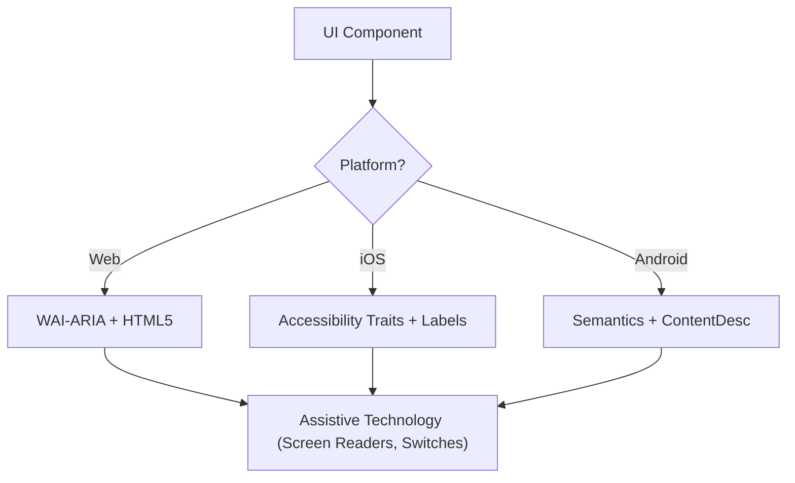

# Accessibility (WCAG 2.2)

This skill ensures that digital interfaces are Perceivable, Operable, Understandable, and Robust (POUR) for all users, including those using screen readers, switch controls, or keyboard navigation. It focuses on the technical implementation of WCAG 2.2 success criteria.

## When to Use

- Defining UI component specifications for Web, iOS, or Android.
- Auditing existing code for accessibility barriers or compliance gaps.
- Implementing new WCAG 2.2 standards like Target Size (Minimum) and Focus Appearance.
- Mapping high-level design requirements to technical attributes (ARIA roles, traits, hints).

## Core Concepts

- **POUR Principles**: The foundation of WCAG (Perceivable, Operable, Understandable, Robust).
- **Semantic Mapping**: Using native elements over generic containers to provide built-in accessibility.
- **Accessibility Tree**: The representation of the UI that assistive technologies actually "read."
- **Focus Management**: Controlling the order and visibility of the keyboard/screen reader cursor.
- **Labeling & Hints**: Providing context through `aria-label`, `accessibilityLabel`, and `contentDescription`.

## How It Works

### Step 1: Identify the Component Role

Determine the functional purpose (e.g., Is this a button, a link, or a tab?). Use the most semantic native element available before resorting to custom roles.

### Step 2: Define Perceivable Attributes

- Ensure text contrast meets **4.5:1** (normal) or **3:1** (large/UI).
- Add text alternatives for non-text content (images, icons).
- Implement responsive reflow (up to 400% zoom without loss of function).

### Step 3: Implement Operable Controls

- Ensure a minimum **24x24 CSS pixel** target size (WCAG 2.2 SC 2.5.8).
- Verify all interactive elements are reachable via keyboard and have a visible focus indicator (SC 2.4.11).
- Provide single-pointer alternatives for dragging movements.

### Step 4: Ensure Understandable Logic

- Use consistent navigation patterns.
- Provide descriptive error messages and suggestions for correction (SC 3.3.3).
- Implement "Redundant Entry" (SC 3.3.7) to prevent asking for the same data twice.

### Step 5: Verify Robust Compatibility

- Use correct `Name, Role, Value` patterns.
- Implement `aria-live` or live regions for dynamic status updates.

## Accessibility Architecture Diagram



## Examples

### Web: Accessible Search

```html
<form role="search">
  <label for="search-input" class="sr-only">Search products</label>
  <input type="search" id="search-input" placeholder="Search..." />
  <button type="submit" aria-label="Submit Search">
    <svg aria-hidden="true">...</svg>
  </button>
</form>
```

## Anti-Patterns to Avoid

- **Div-Buttons**: Using a `<div>` or `<span>` for a click event without adding a role and keyboard support.
- **Color-Only Meaning**: Indicating an error or status _only_ with a color change (e.g., turning a border red).
- **Uncontained Modal Focus**: Modals that don't trap focus, allowing keyboard users to navigate background content while the modal is open. Focus must be contained _and_ escapable via the `Escape` key or an explicit close button (WCAG SC 2.1.2).
- **Redundant Alt Text**: Using "Image of..." or "Picture of..." in alt text (screen readers already announce the role "Image").

## Best Practices Checklist

- [ ] Interactive elements meet the **24x24px** (Web) or **44x44pt** (Native) target size.
- [ ] Focus indicators are clearly visible and high-contrast.
- [ ] Modals **contain focus** while open, and release it cleanly on close (`Escape` key or close button).
- [ ] Dropdowns and menus restore focus to the trigger element on close.
- [ ] Forms provide text-based error suggestions.
- [ ] All icon-only buttons have a descriptive text label.
- [ ] Content reflows properly when text is scaled.

## Factory adaptation (vanilla HTML/JS; frontend-a11y folded in)

- Axe covers roughly 30-40% of WCAG; `engine/tools/check.mjs` runs axe with `wcag22aa` + `target-size` and the remaining criteria are listed as manual in `docs/COMPLIANCE.md`. Never claim "verified" from engines alone.
- Contact form errors: `aria-describedby` to the message, `role="alert"` on the summary, `aria-invalid="true"` on the field.
- Consent "Manage" panel: a real `<button>` with `aria-expanded` + `aria-controls`; the cookie banner is first in tab order.
- Icon-only dock buttons carry `aria-label`; hit areas at least 24x24 (target 44x44).
- Age gate, consent and paytables use native `<dialog>` + `showModal()` (focus is trapped and restored by the platform; no focus-trap library).
- Motion: CSS `@media (prefers-reduced-motion: reduce)` plus a `matchMedia` gate in the game loop.
- Canvas games: keyboard-operable controls outside the canvas, results announced in an `aria-live` region (polite for spins and deals, assertive only for errors), break reminders announced politely; `lang="en-GB"` on every page (per-locale `lang`/`dir` for hotel-casino).
